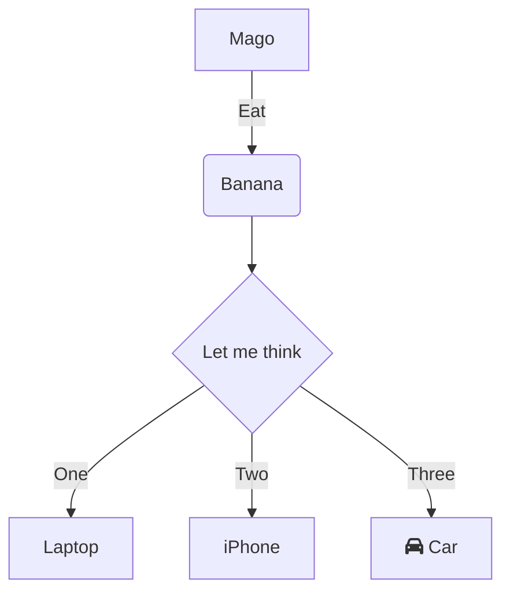

# Game Design Document

Working Title: Test

Author: crimi

Confidentiality Clause:

This Game Design Document (GDD) contains confidential data owned by Crimi.

This document may only be made available to authorized members involved in the development. Any publication and duplication of this GDD - even in part - is prohibited.

- [Game Design Document](#game-design-document)
- [Concept](#concept)
  - [1. High Concept](#1-high-concept)
  - [2. Gameplay](#2-gameplay)
  - [3. Characters](#3-characters)
  - [4. NPCs](#4-npcs)
  - [5. Theme World Design](#5-theme-world-design)
- [Style Inspiration](#style-inspiration)
  - [1. Landscape](#1-landscape)
  - [2. Objects](#2-objects)
  - [3. Player Characters](#3-player-characters)
  - [4. Lightning](#4-lightning)
  - [5. Biomes](#5-biomes)
  - [6. Required Artwork](#6-required-artwork)
- [User Interface, Game Controls](#user-interface-game-controls)
  - [1. General UI](#1-general-ui)
  - [2. Player UI](#2-player-ui)
  - [3. Shop UI](#3-shop-ui)
  - [4. Major UI](#4-major-ui)
  - [5. Settings Menu](#5-settings-menu)
  - [6. Game Controls](#6-game-controls)
- [Platform and Monetization](#platform-and-monetization)
  - [1. PC](#1-pc)
  - [2. Switch](#2-switch)
  - [3. Addons](#3-addons)
  - [4. Marketing and Target Audience](#4-marketing-and-target-audience)
- [Team](#team)
  - [1. Rolls](#1-rolls)
- [TimeFrame](#timeframe)
  - [1. Low-Fidelity Prototyp](#1-low-fidelity-prototyp)
  - [2. High-Fidelity Prototyp](#2-high-fidelity-prototyp)
  - [3. Alpha Game](#3-alpha-game)
  - [4. Beta Game](#4-beta-game)
  - [5. Full Fame](#5-full-fame)
- [Open Points](#open-points)

# Concept

## 1. High Concept

## 2. Gameplay

## 3. Characters

## 4. NPCs

## 5. Theme World Design

# Style Inspiration

## 1. Landscape

## 2. Objects

## 3. Player Characters

## 4. Lightning

## 5. Biomes

## 6. Required Artwork

# User Interface, Game Controls

## 1. General UI

## 2. Player UI

## 3. Shop UI

## 4. Major UI

## 5. Settings Menu

## 6. Game Controls

# Platform and Monetization

## 1. PC

## 2. Switch

## 3. Addons

## 4. Marketing and Target Audience

# Team

## 1. Rolls

# TimeFrame

## 1. Low-Fidelity Prototyp

## 2. High-Fidelity Prototyp

## 3. Alpha Game

## 4. Beta Game

## 5. Full Fame

# Open Points

sdsdsd
